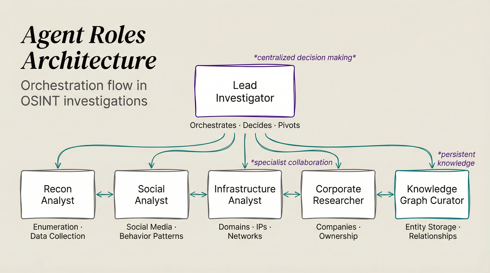

# OSINT Agent Roles Reference

Complete reference for OSINT specialist agent roles, their trait combinations, voices, and appropriate work types.

<p align="center">
  
</p>

## Tier 1: Enumeration Specialists (Collection)

| Role | Traits | Voice | Work Types | Use For Workflows |
|------|--------|-------|------------|-------------------|
| **Recon** | `intelligence,analytical,exploratory` | Sophisticated | Discovery, enumeration, platform scanning | UsernameRecon, initial collection phases |
| **Scanner** | `intelligence,technical,systematic` | Authoritative | DNS, ports, infrastructure scanning | DomainRecon, InfraMapping |
| **Collector** | `intelligence,meticulous,thorough` | Sophisticated | Profile capture, data extraction | SocialCapture, comprehensive data gathering |
| **Enumerator** | `intelligence,analytical,systematic` | Sophisticated | Email/phone validation, breach checks | EmailRecon, PhoneRecon |

## Tier 2: Analysis Specialists (Processing)

| Role | Traits | Voice | Work Types | Use For Workflows |
|------|--------|-------|------------|-------------------|
| **Analyst** | `intelligence,analytical,synthesizing` | Sophisticated | Pattern analysis, correlation, inference | EntityLinking, TimelineAnalysis |
| **TechAnalyst** | `intelligence,technical,meticulous` | Authoritative | Infrastructure analysis, forensics | InfraMapping, ImageRecon, DomainRecon |
| **FinanceAnalyst** | `intelligence,finance,thorough` | Professional | SEC filings, funding, valuations | FinancialRecon |
| **BusinessAnalyst** | `intelligence,business,comparative` | Professional | Market analysis, competitive intel | CompetitorAnalysis, CompanyProfile |
| **PatternAnalyst** | `intelligence,analytical,systematic` | Sophisticated | Timeline patterns, anomaly detection | TimelineAnalysis |

## Tier 3: Correlation Specialists (Linking)

| Role | Voice | Work Types | Use For Workflows |
|------|-------|------------|-------------------|
| **Linker** | `intelligence,analytical,synthesizing` | Sophisticated | Identity resolution, account linking | EntityLinking |
| **Correlator** | `intelligence,analytical,exploratory` | Sophisticated | Cross-source correlation, pivot detection | InvestigationOrchestrator expansion |

## Tier 4: Assessment Specialists (Risk/Verification)

| Role | Traits | Voice | Work Types | Use For Workflows |
|------|--------|-------|------------|-------------------|
| **Auditor** | `intelligence,security,skeptical` | Intense | Risk assessment, due diligence, sanctions | RiskAssessment |
| **Verifier** | `intelligence,meticulous,systematic` | Sophisticated | Source verification, validation | All workflows (verification steps) |
| **Shadow** | `intelligence,security,adversarial` | Intense | Threat modeling, attack surface | Security-focused assessments |

## Tier 5: Synthesis Specialists (Output)

| Role | Traits | Voice | Work Types | Use For Workflows |
|------|--------|-------|------------|-------------------|
| **Synthesizer** | `intelligence,communications,synthesizing` | Authoritative | Report generation, consolidation | IntelReport, TargetProfile synthesis |
| **Briefer** | `intelligence,communications,consultative` | Authoritative | Executive summaries, recommendations | IntelReport, final briefings |
| **Researcher** | `intelligence,business,systematic` | Professional | Corporate structure, ownership tracing | CorporateStructure, CompanyProfile |

## Work Type → Recommended Role Mapping

| Work Type | Primary Role | Alternate Role | Traits Pattern |
|-----------|--------------|----------------|----------------|
| **Enumeration** | Recon | Enumerator | `intelligence,analytical,exploratory` |
| **Technical Analysis** | TechAnalyst | Scanner | `intelligence,technical,*` |
| **Financial Analysis** | FinanceAnalyst | BusinessAnalyst | `intelligence,finance,thorough` |
| **Correlation** | Linker | Analyst | `intelligence,analytical,synthesizing` |
| **Pattern Detection** | PatternAnalyst | Analyst | `intelligence,analytical,systematic` |
| **Risk Assessment** | Auditor | Shadow | `intelligence,security,skeptical` |
| **Verification** | Verifier | Auditor | `intelligence,meticulous,systematic` |
| **Synthesis** | Synthesizer | Briefer | `intelligence,communications,synthesizing` |
| **Reporting** | Briefer | Synthesizer | `intelligence,communications,consultative` |
| **Corporate Research** | Researcher | BusinessAnalyst | `intelligence,business,systematic` |
| **Infrastructure** | Scanner | TechAnalyst | `intelligence,technical,systematic` |
| **Profile Capture** | Collector | Recon | `intelligence,meticulous,thorough` |

## Workflow Step → Agent Role Assignment

For multi-step workflows, assign specific roles to each phase:

### InvestigationOrchestrator Phases
| Phase | Role | Traits |
|-------|------|--------|
| Initial Collection | Recon | `intelligence,analytical,exploratory` |
| Domain Pivots | Scanner | `intelligence,technical,systematic` |
| Email Pivots | Enumerator | `intelligence,analytical,systematic` |
| Company Pivots | Researcher | `intelligence,business,systematic` |
| Correlation | Linker | `intelligence,analytical,synthesizing` |
| Synthesis | Synthesizer | `intelligence,communications,synthesizing` |

### TargetProfile Phases
| Phase | Role | Traits |
|-------|------|--------|
| Username Scan | Recon | `intelligence,analytical,exploratory` |
| Domain Analysis | Scanner | `intelligence,technical,systematic` |
| Social Capture | Collector | `intelligence,meticulous,thorough` |
| Entity Linking | Linker | `intelligence,analytical,synthesizing` |
| Timeline Analysis | PatternAnalyst | `intelligence,analytical,systematic` |
| Final Report | Briefer | `intelligence,communications,consultative` |

### CompanyProfile Phases
| Phase | Role | Traits |
|-------|------|--------|
| Registry Research | Researcher | `intelligence,business,systematic` |
| Corporate Structure | Researcher | `intelligence,business,systematic` |
| Financial Analysis | FinanceAnalyst | `intelligence,finance,thorough` |
| Competitive Intel | BusinessAnalyst | `intelligence,business,comparative` |
| Risk Assessment | Auditor | `intelligence,security,skeptical` |
| Synthesis | Synthesizer | `intelligence,communications,synthesizing` |

## Spawning Agents with AgentFactory

Use AgentFactory to generate OSINT specialists with proper traits:

```bash
# Example: Spawn a Collector for username enumeration
bun run $PAI_DIR/skills/Agents/Tools/AgentFactory.ts \
  --traits "intelligence,meticulous,thorough" \
  --task "Enumerate username johndoe across platforms" \
  --output json
```

Then spawn via Task tool with the generated prompt.
