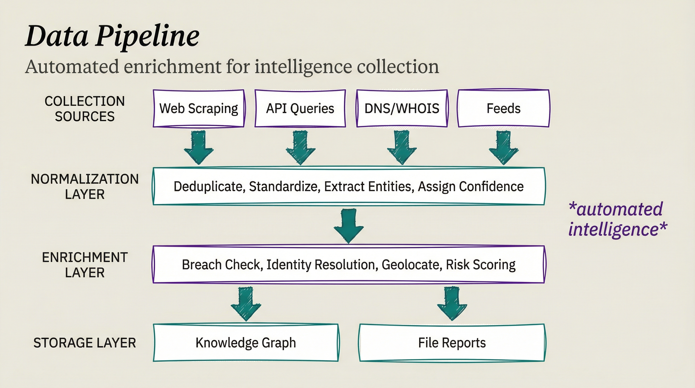

# Development

Technical documentation for developers extending or maintaining the OSINT skill.

<p align="center">
  
</p>

## Development Topics

- **[Image Analysis Tools](IMAGE_ANALYSIS_TOOLS.md)** - Tool requirements and setup
- **[OSINT Image Analysis Research](OSINT_IMAGE_ANALYSIS_RESEARCH.md)** - Research on image analysis capabilities
- **[Enrichment Roadmap](ENRICHMENT_ROADMAP.md)** - API integration guide for data enrichment

## Project Structure

```
madeinoz-osint-skill/
├── osint/                     # The entire skill (symlinked into ~/.claude/skills/osint)
│   ├── SKILL.md               # Skill metadata, intent routing, memory adapter
│   ├── AgentProfiles.yaml     # Agent personality configurations
│   ├── Workflows/             # Investigation workflow definitions
│   └── References/            # Agent roles, voice mappings, memory groups
├── src/tools/                 # Optional bun-powered image-forensic utilities
├── docs/                      # User and developer documentation
├── config/                    # Configuration files (e.g. voices.json)
└── package.json               # Node.js dependencies for src/tools
```

## Contributing

When adding new workflows:

1. Create workflow file in `skills/osint/Workflows/`
2. Add trigger pattern to `SKILL.md`
3. Update documentation in `docs/`
4. Test with various inputs
5. Verify findings persist via the memory adapter (see `skills/osint/SKILL.md` § Memory Adapter)

## Workflow Template

```markdown
# WorkflowName

## Purpose
Brief description of what this workflow does.

## Triggers

- "trigger phrase 1"
- "trigger phrase 2"

## Prerequisites

- Required skills
- Required tools
- Required permissions

## Steps

1. First step
2. Second step
3. etc.

## Output

What the workflow produces.

## Storage

How findings persist via the memory adapter (see `skills/osint/SKILL.md` § Memory Adapter) — group name, one finding per entry, entities named.
```
