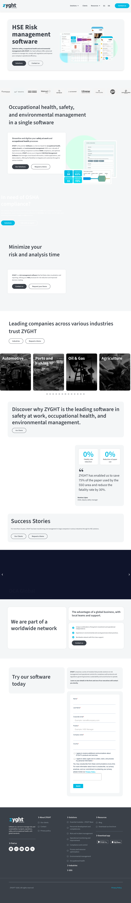
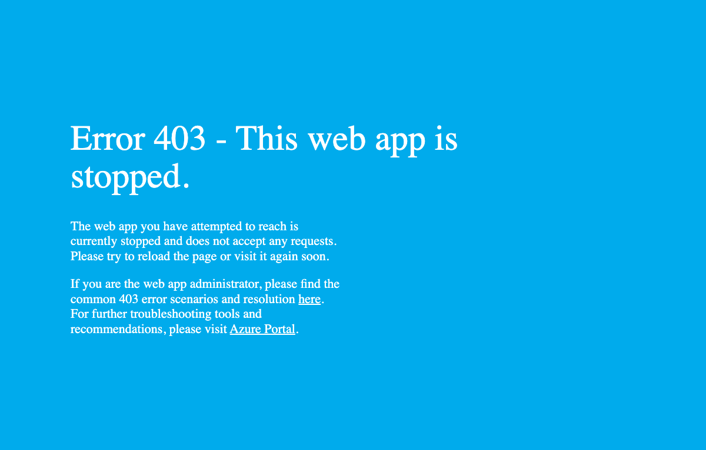
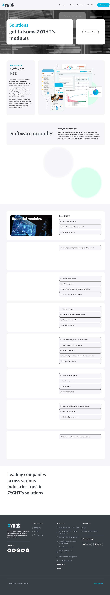
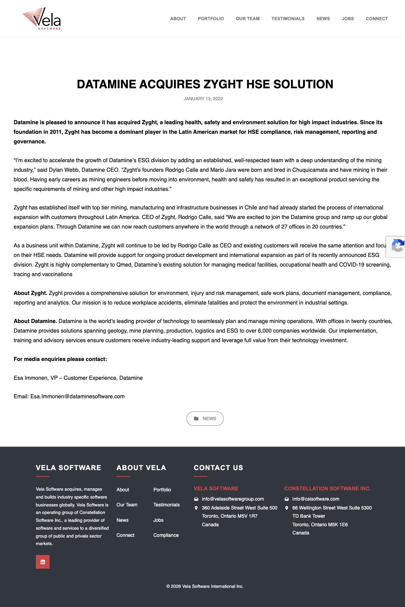
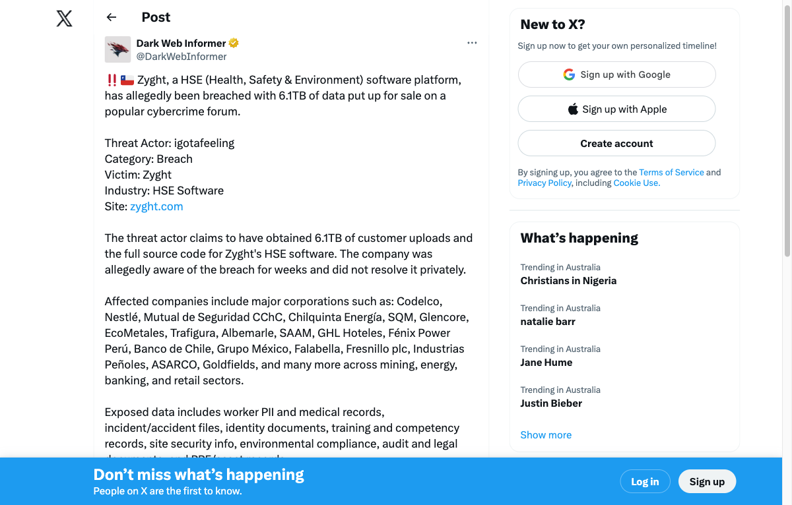
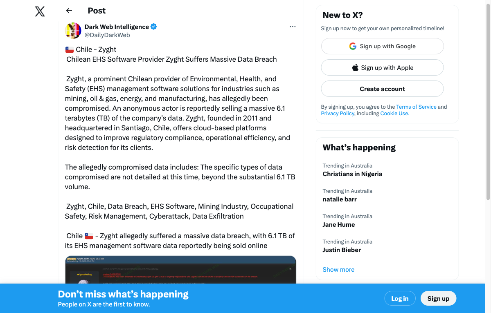
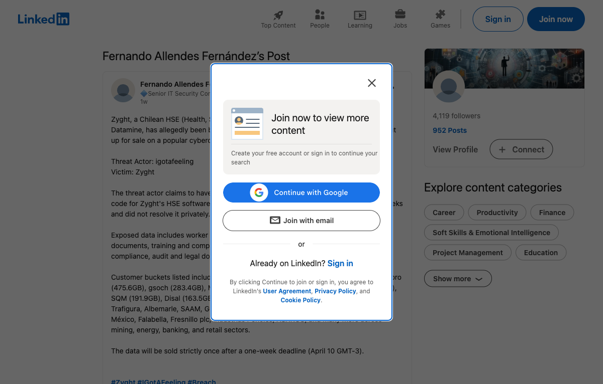
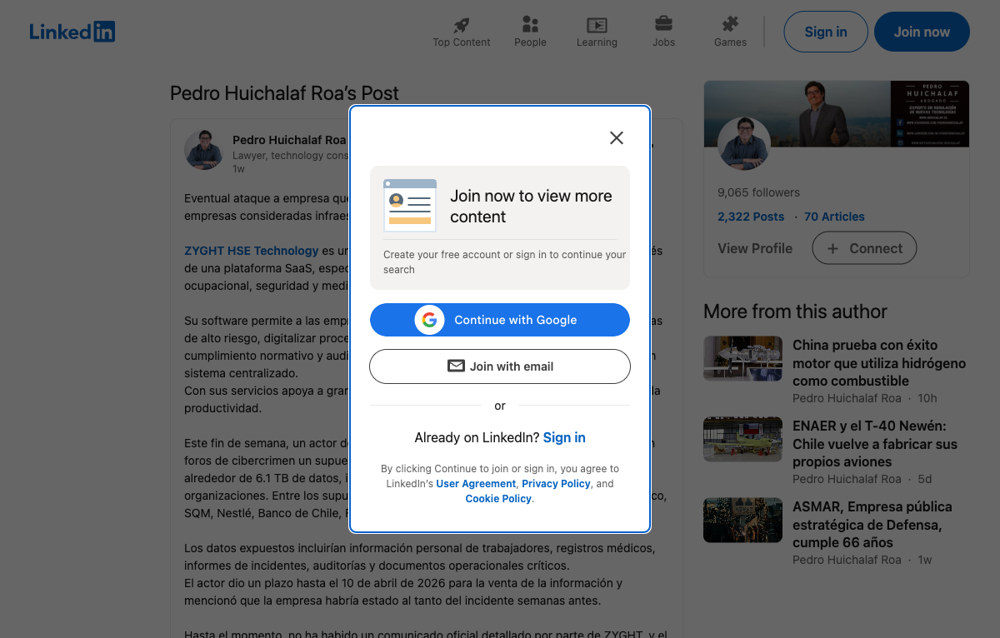

\newpage

# Document Control

| Field | Value |
|---|---|
| **Investigation ID** | OSINT-INV-2026-ALB-ZYG |
| **Report Date** | April 14, 2026 |
| **Classification** | UNCLASSIFIED |
| **Version** | 2.0 (Updated with threat actor attribution + expanded intelligence) |
| **Status** | ONGOING --- Monitoring active; DEADLINE EXTENDED TO APRIL 15 |
| **Prepared By** | PAI OSINT Investigation Orchestrator |
| **Client** | Stephen Eaton |

\newpage

# Executive Summary

**VERDICT: SUPPLY CHAIN DATA BREACH CONFIRMED --- No vendor disclosure issued**

Zyght, a Chilean Health, Safety & Environment (HSE) SaaS platform owned by Datamine (a Constellation Software subsidiary), was breached with **6.1 terabytes** of customer data exfiltrated, along with the platform's full source code. A threat actor posted the data for sale on a cybercrime forum on **April 3, 2026**.

**Albemarle Corporation is a confirmed Zyght customer** with a dedicated tenant instance at `albemarle.zyght.com`. As of April 14, 2026, this tenant is **deliberately stopped** on Microsoft Azure App Service (returning an HTTP 403 "Web App Stopped" error), strongly suggesting incident response containment.

**No public breach disclosure** has been issued by Zyght, Datamine, Constellation Software, or Albemarle Corporation as of the date of this report --- eleven days after the threat actor's initial post.

**CRITICAL FINDINGS:**

- **Threat actor "igotafeeling" CONFIRMED** --- serial operator with prior Loblaw (Canada, 75.1M records) breach in March 2026
- **6.1 TB** of Zyght customer data exfiltrated plus full platform source code
- **90+ organizations** affected including Codelco, Nestle, SQM, Glencore, Albemarle, Banco de Chile, Falabella
- **19M+ files** across mining, energy, banking, and retail sectors
- Albemarle Corporation is a **confirmed Zyght customer** (logo on website + dedicated subdomain)
- Albemarle's Zyght tenant is **deliberately stopped** on Azure --- probable incident containment
- **Deadline EXTENDED to April 15** (from original April 10); negotiations claimed ongoing; data NOT yet publicly leaked
- **No vendor disclosure** after 11 days since threat actor post
- Albemarle SEC 10-K (March 11, 2026) stated "no material cyber incidents in past three years" --- filed BEFORE breach went public
- Data at risk includes occupational health records (PII/PHI), mining incident reports, environmental compliance data, and safe work permits

\newpage

# Breach Event Details

## Timeline of Events

| Date | Event | Source |
|---|---|---|
| March 13, 2026 | igotafeeling posts Loblaw/Shoppers Drug Mart breach (75.1M+ records) | [DarkWebInformer](https://x.com/DarkWebInformer/status/2032507127814558146) |
| March 15, 2026 | igotafeeling releases 251,366 Salesforce records as proof for Loblaw | [DarkWebInformer](https://x.com/DarkWebInformer/status/2033230547636363517) |
| March 19, 2026 | Loblaw deadline passes; igotafeeling post deleted (likely private settlement) | Forum observation |
| April 3, 2026 | igotafeeling posts "[SELLING] zyght.com 2026 \| 6.1TB" on cybercrime forum | Cybercrime forum |
| April 4, 2026 | @DarkWebInformer reports breach on X/Twitter | [DarkWebInformer](https://x.com/DarkWebInformer/status/2040241968886739355) |
| April 4, 2026 | German Fernandez (@1ZRR4H) publishes attack surface analysis (33.9K views) | [@1ZRR4H](https://x.com/1ZRR4H/status/2040511409667158351) |
| April 6, 2026 | Pedro Huichalaf (fmr Chilean Undersecretary of Telecom) posts critical infrastructure warning | [Huichalaf](https://x.com/huichalaf/status/2041144907956363534) |
| April 7, 2026 | Pedro Huichalaf LinkedIn post: supply chain risk analysis, 90+ orgs, 19M+ files | [LinkedIn](https://es.linkedin.com/posts/pedrohuichalaf_eventual-ataque-a-empresa-que-es-parte-importante-activity-7446909720604344320-Tfi8) |
| April 9, 2026 | @DailyDarkWeb confirms Chilean EHS software breach | [DailyDarkWeb](https://x.com/DailyDarkWeb/status/2042302785425703322) |
| April 10, 2026 | igotafeeling's original sale deadline passes | Forum observation |
| April 10, 2026 | @DailyDarkWeb posts additional breach details | [DailyDarkWeb](https://x.com/DailyDarkWeb/status/2042786257395175621) |
| April 14, 2026 | Albemarle Zyght tenant confirmed still stopped on Azure (HTTP 403) | Direct observation |
| April 14, 2026 | Deadline EXTENDED to April 15 due to ongoing negotiations | [@huichalaf profile update](https://x.com/huichalaf) |
| April 14, 2026 | No vendor disclosure issued by any party | All sources checked |

## Breach Characteristics

| Attribute | Detail |
|---|---|
| **Threat Actor** | "igotafeeling" (CONFIRMED via DarkWebInformer, DailyDarkWeb, multiple media) |
| **Initial Access Vector** | Not publicly disclosed; consistent with credential compromise or cloud misconfiguration |
| **Data Volume** | 6.1 TB customer data + full source code |
| **Forum Post Title** | "[SELLING] zyght.com 2026 \| 6.1TB" |
| **Actor Claims** | Zyght was aware for weeks and did not resolve privately |
| **Data Status** | Deadline extended to April 15, 2026 (from original April 10); negotiations claimed ongoing; data NOT yet publicly leaked |
| **Sale Outcome** | Original April 10 deadline passed without confirmed sale; actor extended deadline citing ongoing negotiations |
| **Official Response** | None issued as of April 14, 2026 by Zyght, Datamine, Constellation Software, or Albemarle |

\newpage

\newpage

# Threat Actor Profile: "igotafeeling"

## Actor Identification

| Attribute | Detail |
|---|---|
| **Handle** | igotafeeling |
| **Confidence** | HIGH --- Confirmed by DarkWebInformer, DailyDarkWeb, CyberAGroup, multiple media outlets |
| **Active Forums** | DarkForums (darkforums.su, user ID 61687), DarkWeb Informer (darkwebinformer.com), PwnForums (pwnforums.st) |
| **Forum Tier** | "GOD" level on DarkWeb Informer (highest paid tier, indicating significant financial investment in forum presence) |
| **Account Pattern** | Creates new accounts for each campaign; Loblaw post was from a single-thread account that was deleted after resolution |
| **First Observed** | March 2026 (Loblaw/Shoppers Drug Mart breach) |
| **Operating Model** | Data exfiltration and sale, NOT ransomware; extortion via public disclosure threat |

## Known Campaign History

| Date | Target | Data Volume | Industry | Country | Status |
|---|---|---|---|---|---|
| Mar 13, 2026 | Loblaw / Shoppers Drug Mart | 75.1M Salesforce records, 724.9M SDM rows, 3,014 GitLab projects, 19.3M Oracle IDCS records | Retail/Pharmacy | Canada | Post deleted Mar 19; possible private settlement |
| Apr 3, 2026 | Zyght (HSE SaaS platform) | 6.1TB customer data + full source code | HSE Software/Mining/Energy/Banking | Chile (global clients) | Active sale; 1-week deadline (Apr 10 GMT-3) |

## Tactics, Techniques, and Procedures (TTPs)

### Observed Modus Operandi

1. **Initial Access**: Method not confirmed for either breach. The Loblaw breach involved access to Salesforce, Oracle IDCS, GitLab, and SFMC systems. The Zyght breach involved access to Azure-hosted customer blob storage and source code repositories. Consistent with compromised credentials (potentially via infostealer logs or third-party vendor compromise) or cloud misconfiguration exploitation.

2. **Data Exfiltration**: Massive scale exfiltration across multiple data stores:
   - Loblaw: Salesforce, Hybris, Oracle IDCS, GitLab, SFMC, Postgres (1B+ rows total)
   - Zyght: Azure blob storage (6.1TB) + full application source code
   - Demonstrates deep understanding of enterprise SaaS architecture (Salesforce, Oracle, Azure)

3. **Source Code Theft**: Both breaches included source code exfiltration (3,014 GitLab projects at Loblaw; full platform source code at Zyght). This is a distinctive pattern --- source code theft increases leverage for both sale value and potential future exploitation.

4. **Public Disclosure Strategy**: Uses cybercrime forums for maximum visibility. Employs a deadline-based approach:
   - Loblaw: "March 19th deadline to reach out or data will be publicly leaked"
   - Zyght: "one-week deadline (April 10 GMT-3) before selling strictly once"
   - Gives victims a window to negotiate privately

5. **Extortion Without Encryption**: Does NOT deploy ransomware. Pure data theft and sale/extortion model. This distinguishes igotafeeling from ransomware operators.

6. **Communication Style**: Uses casual, confrontational language. At Loblaw: "so looks like loblaw's genius idea is to just ghost us and lie to everyone." At Zyght: claims victim "was aware of the breach for weeks and did not resolve it privately." Positions themselves as responding to corporate dishonesty.

7. **Sales Model**: "Sold strictly once" --- positions as exclusive sale rather than mass distribution. This may be both a genuine sales constraint and a negotiation tactic to increase perceived value.

### MITRE ATT&CK Alignment (Estimated)

| Tactic | Technique | Confidence |
|---|---|---|
| Initial Access | T1078 Valid Accounts (likely) | Medium |
| Initial Access | T1190 Exploit Public-Facing Application (possible) | Low |
| Discovery | T1082 System Information Discovery | Medium |
| Collection | T1005 Data from Local System | High |
| Collection | T1530 Data from Cloud Storage | High |
| Exfiltration | T1567 Exfiltration Over Web Service | Medium |
| Impact | T1659 Content Wipe (implied by deleting posts post-negotiation) | Medium |

## Actor Personality Assessment

- **English language fluency**: High --- uses colloquial English ("genius idea", "ghost us")
- **Technical sophistication**: HIGH --- demonstrates ability to navigate complex enterprise SaaS environments, exfiltrate from multiple data stores simultaneously, and maintain operational security
- **Financial motivation**: Primary --- all activities are monetarily driven (data sale, not hacktivism)
- **OPSEC awareness**: Moderate-high --- deletes forum posts after resolution (Loblaw), uses paid premium forum accounts, creates fresh accounts per campaign
- **Geographic indicators**: None definitive. Targets span Canada and Latin America. No linguistic clues pointing to specific region.
- **Threat level**: HIGH --- proven capability against major enterprises, willingness to hold critical infrastructure data (mining safety, pharmacy records) for ransom

## Comparison to Known Threat Actor Groups

| Group | Similarity | Difference |
|---|---|---|
| **IntelBroker** | Data sale model, forum-based, targets enterprise SaaS | IntelBroker focuses on government/defense; igotafeeling targets commercial retail/SaaS |
| **Scattered Spider (UNC3944)** | Cloud-focused, source code theft, broad enterprise access | Scattered Spider uses social engineering; igotafeeling's access method unknown |
| **Zestix/Sentap** | Uses infostealer-derived credentials | Zestix is more prolific (dozens of breaches); igotafeeling appears more selective/quality-focused |
| **ALPHV/BlackCat** | Deadline-based extortion | ALPHV is ransomware; igotafeeling is pure data theft |

**Assessment**: igotafeeling does not clearly match any single known threat actor group. The TTP pattern (massive data exfiltration + source code theft + forum-based sale without ransomware) is most consistent with the broader "data broker" category of cybercriminals who emerged post-2022. **Confidence: Medium that this is a solo operator or small group specializing in cloud/SaaS environments.**

## Forum Presence Analysis

| Forum | Handle | Status | Notes |
|---|---|---|---|
| DarkWeb Informer | igotafeeling | Active (confirmed Mar-Apr 2026) | Primary posting forum; "GOD" level account |
| DarkForums (darkforums.su) | igotafeeling (user 61687) | Active (recent post "Yesterday, 07:55 PM") | Legacy RaidForums successor; 2,000+ concurrent users |
| PwnForums (pwnforums.st) | igotafeeling | Active (observed in Sellers Place) | Newer forum; emerged after BreachForums seizures |

## Key Intelligence Gaps

1. **True identity**: No known real-world attribution
2. **Initial access vector**: How the actor gains access to cloud environments (credential stuffing? infostealer? cloud misconfiguration? insider?)
3. **Actor's country of origin**: No definitive geographic indicators
4. **Total number of victims**: Only 2 confirmed campaigns; there may be undisclosed/settled breaches
5. **Loblaw resolution**: The March 19 deadline post was deleted --- whether a ransom was paid, data was destroyed, or law enforcement intervened is unknown
6. **Zyght sale outcome**: Whether the April 10 deadline resulted in a sale or private settlement is unknown

\newpage

# Zyght Company Intelligence Profile

## Company Overview

| Field | Detail |
|---|---|
| **Company Name** | ZYGHT |
| **Type** | HSE (Health, Safety & Environment) Risk Management SaaS Platform |
| **Founded** | 2011 |
| **Headquarters** | Chile |
| **CEO** | Rodrigo Calle (co-founder) |
| **Co-Founder** | Mario Jara |
| **Founders' Background** | Both former mining engineers from Chuquicamata, Chile |
| **Employees** | Not publicly disclosed |

## Corporate Structure

```
Constellation Software (TSX:CSU)
  └── Vela Software Group
        └── Datamine
              └── Zyght (acquired January 2022)
```

| Level | Entity | Details |
|---|---|---|
| **Ultimate Parent** | Constellation Software | TSX:CSU, publicly traded Canadian software conglomerate |
| **Intermediate Parent** | Vela Software Group | Constellation's vertical market software division |
| **Direct Parent** | Datamine | World's leading mining technology provider |
| **Target** | Zyght | HSE SaaS platform, acquired January 2022 |

## Datamine Group Profile

| Metric | Value |
|---|---|
| **Global Offices** | 27 offices in 20 countries |
| **Customer Base** | 6,000+ companies worldwide |
| **Focus Areas** | Mining technology, ESG, safety solutions |
| **Zyght Division** | ESG Division |
| **CEO (Datamine)** | Dylan Webb |
| **VP Customer Experience** | Esa Immonen (Esa.Immonen@dataminesoftware.com) |

## Zyght Customer Base

Zyght's homepage displays logos of **62+ client companies** across **13 industry sectors**:

**Notable Clients:** Codelco, Collahuasi, Ecolab, Concha y Toro, Comfrut, Colbun, Chilquinta, Grupo Minero las Cenizas, Disal, DeliBest, Scania, OCA Global

## Confirmed Affected Customer Data Buckets (from igotafeeling listing)

| Customer | Data Volume | Notes |
|---|---|---|
| Codelco | 769.4 GB | Chilean state copper mining company |
| gssodet | 629.1 GB | Unknown entity |
| Codelco-prepro | 475.6 GB | Codelco pre-production environment |
| gsoch | 283.4 GB | Unknown entity |
| Mutual | 281.0 GB | Likely mutual insurance/safety entity |
| Chilquinta | 232.1 GB | Chilean energy company |
| Nestle | 201.9 GB | Global food & beverage |
| SQM | 191.9 GB | Chilean lithium/chemicals producer |
| Disal | 163.5 GB | Chilean environmental services |
| Goldfields | 145.6 GB | Gold mining company |
| **+ Albemarle, Glencore, EcoMetales, Trafigura, SAAM, GHL Hoteles, Fenix Power Peru, Banco de Chile, Grupo Mexico, Falabella, Fresnillo plc, Industrias Penoles, ASARCO, and many more** | Total: 6.1 TB | 90+ organizations, 19M+ files |

**Industries Served:** Agriculture, Food & Beverages, Transportation & Logistics, Retail, Mining, Banking & Finance, Energy, Construction, Chemical, Manufacturing, Automotive, Ports & Fishing, Oil & Gas

## Technical Profile

| Attribute | Detail |
|---|---|
| **Architecture** | Cloud SaaS |
| **Hosting** | Microsoft Azure App Service |
| **Mobile Apps** | iOS and Android |
| **Standards Compliance** | OSHA, ISO 45001, ISO 14001, ISO 9001 |
| **Methodology** | PDCA (Plan, Do, Check, Act) |
| **Analytics** | BI dashboards + premium reporting |
| **Social Media** | LinkedIn, Twitter/X, Instagram, Facebook, YouTube |

\newpage

# Zyght Platform Module Analysis

Zyght's platform consists of **8 module categories with 25+ sub-modules**, each handling sensitive operational data:

## Module Category 1: Essential (ZYGHT Base)

| Module | Data Types |
|---|---|
| Strategic Management | HSE strategy documents, KPIs, targets, management review records |
| Operational Controls | Standard operating procedures, control measures, monitoring plans |
| Standard BI Reports | Operational dashboards, trend reports, compliance metrics |

## Module Category 2: Personnel Development

| Module | Data Types |
|---|---|
| Training & Competency | Training records, certifications, competency assessments, license expiry dates, qualification data |

## Module Category 3: Risk & Incident Management

| Module | Data Types |
|---|---|
| Incident Management | Incident reports, investigation findings, root cause analysis, corrective actions, near-miss data |
| Risk Management | Risk matrices, risk assessments, hazard identification, risk scores, treatment plans |
| PPE Management | PPE inventory, assignment records, inspection dates, replacement logs |
| Digital JSA | Job Safety Analysis records, task hazard assessments, control plans |

## Module Category 4: Operational Monitoring

| Module | Data Types |
|---|---|
| Premium BI Reports | Executive dashboards, benchmarking analytics, predictive models |
| Operational Excellence | Continuous improvement records, performance metrics |
| Change Management | Management of change records, impact assessments |
| Report Management | Report templates, distribution lists, scheduled reports |

## Module Category 5: Compliance & Control

| Module | Data Types |
|---|---|
| Contract Management | Contractor accreditations, pre-qualification data, insurance certificates |
| Legal Requirements | Regulatory compliance status, obligation registers, legal tracking |
| Audit Management | Audit findings, corrective actions, audit schedules, non-conformances |
| Community Relations | Stakeholder engagement records, community complaint data |
| Occupational Enabling | Worker registration, role assignments, access control records |

## Module Category 6: Process & Resource Optimization

| Module | Data Types |
|---|---|
| Document Management | Policies, procedures, SOPs, work instructions, forms |
| Asset Management | Safety equipment inventory, maintenance records, lifecycle data |
| Action Plans | Corrective/preventive actions, task assignments, deadlines |
| Safe Work Permits | Permit-to-work records, isolation certificates, hot work permits, confined space entries, LOTO records |

## Module Category 7: Environmental Management

| Module | Data Types |
|---|---|
| Environmental Commitments | Environmental obligations, permit conditions, targets |
| Waste Management | Waste tracking, disposal records, manifest data |
| Biodiversity Management | Biodiversity assessments, habitat monitoring, species data |

## Module Category 8: Occupational Health

| Module | Data Types |
|---|---|
| Medical Surveillance | Health assessment records, exposure monitoring, hearing tests, fitness-for-duty evaluations, biological monitoring |

\newpage

# Albemarle Corporation Exposure Assessment

## Albemarle-Zyght Relationship: CONFIRMED

Two independent sources confirm Albemarle Corporation as a Zyght customer:

1. **Client Logo:** Albemarle's logo appears on the Zyght homepage client carousel at `zyght.com/en/` (image alt-text: "logo Albemarle ZYGHT software hse")
2. **Dedicated Subdomain:** `albemarle.zyght.com/web/login` exists with Datamine branding, indicating a dedicated tenant instance

## Albemarle Zyght Tenant Status

| Attribute | Detail |
|---|---|
| **URL** | `https://albemarle.zyght.com/web/login` |
| **Current Status** | HTTP 403 --- "Web App Stopped" |
| **Platform** | Microsoft Azure App Service |
| **Error Meaning** | Application deliberately stopped by administrator |
| **Significance** | NOT a temporary outage; indicates intentional shutdown |
| **Likely Cause** | Incident response containment OR tenant decommission |

**Technical Note:** An Azure App Service HTTP 403 with "Web App Stopped" message specifically means an administrator with Azure Portal access has explicitly stopped the web application. This is distinct from a firewall block, authentication failure, or temporary service interruption.

## Albemarle Data Profile (High-Confidence Inference)

Given Albemarle's profile as a global specialty chemicals company operating lithium mines and processing facilities across multiple continents, their Zyght tenant data would include:

### Mining Operations (Lithium --- Australia, Chile, United States)

- Mine site incident reports and near-miss data
- Occupational exposure monitoring (dust, chemicals, noise)
- Safe work permits for mining and processing operations
- Risk assessments for lithium extraction and processing
- JSA records for mining-specific tasks

### Chemical Processing (Bromine, Catalysts)

- Chemical handling safety records
- Process safety management data
- Hazardous materials tracking
- Environmental emissions data
- Chemical storage and handling permits

### Workforce Data

- Employee health surveillance records (PII/PHI exposure risk)
- Training and competency certifications
- PPE assignments and inspection records
- Contractor accreditations and safety performance data
- Fitness-for-duty evaluations

### Regulatory Compliance

- OSHA compliance records (US operations)
- ISO 45001/14001/9001 audit findings
- Environmental permit compliance data
- Legal requirement tracking across jurisdictions (US, Chile, Australia)
- Regulatory inspection records

## Data Sensitivity Ranking

| Priority | Data Type | Sensitivity | Risk Category |
|---|---|---|---|
| 1 | Occupational health records | PII/PHI | Privacy violation, regulatory |
| 2 | Incident reports with operational details | Operational | Competitive intelligence, safety reputation |
| 3 | Risk assessments for mining/chemical operations | Strategic | Operational vulnerability, competitive |
| 4 | Safe work permits | Operational | Procedure exposure, physical security |
| 5 | Environmental compliance data | Regulatory | Regulatory risk, reputational |
| 6 | Contractor accreditation and PII | Third-party | Privacy violation, relationship damage |
| 7 | Training and competency records | Operational | Workforce intelligence |
| 8 | PPE inventory and document management | Low | Minimal direct risk |

\newpage

# Breach Disclosure Monitoring Status

## Sources Checked (No Disclosures Found)

| Source | Status | Date Checked |
|---|---|---|
| Zyght official website | No breach notice | April 14, 2026 |
| Datamine official channels | No statement | April 14, 2026 |
| Constellation Software (TSX:CSU) filings | No disclosure | April 14, 2026 |
| Albemarle Corporation (NYSE:ALB) SEC filings | No cybersecurity 8-K; 10-K (Mar 11) stated "no material cyber incidents in 3 years" (pre-breach) | April 14, 2026 |
| General news search (multiple engines) | No English-language articles; Spanish/Chilean community coverage only | April 14, 2026 |
| Chilean data protection authority | No filing found | April 14, 2026 |
| Maine AG breach portal (US) | No filing found | April 14, 2026 |
| Dark web monitoring | Deadline extended to April 15; data NOT yet publicly leaked | April 14, 2026 |
| LinkedIn posts | Multiple discussions: Fernando Allendes, Pedro Huichalaf, others | April 14, 2026 |
| X/Twitter monitoring | @DarkWebInformer (last post Apr 3), @DailyDarkWeb (last post Apr 10), @1ZRR4H (Apr 4 analysis) | April 14, 2026 |
| PKWARE 2026 Data Breaches | Zyght NOT listed | April 14, 2026 |
| German Fernandez (@1ZRR4H) analysis | Attack surface analysis (33.9K views); Zyght remains silent | April 4, 2026 |
| Competitor intelligence | Prodity Software leveraging breach for marketing | April 14, 2026 |

## Active Monitoring Schedule

| Parameter | Value |
|---|---|
| **Frequency** | 3 times daily |
| **Times** | 10:17, 16:17, 22:17 (local time) |
| **Duration** | 7 days (auto-expires April 21, 2026) |
| **Search Queries** | "Zyght breach statement", "Datamine cyber incident", "Zyght data breach update", "Constellation Software cybersecurity" |
| **Storage** | Knowledge graph group: osint-investigation-ALB-ZYG-2026 |
| **Alert Trigger** | New vendor statements, regulatory filings, news articles |

\newpage

# Risk Assessment

## Overall Risk Rating: CRITICAL

**Supply Chain Data Compromise --- Severity: CRITICAL**

## Risk Factor Analysis

| Risk Factor | Level | Detail |
|---|---|---|
| **Data Volume** | CRITICAL | 6.1 TB suggests comprehensive exfiltration of all customer data |
| **Source Code Exposure** | HIGH | Enables further targeted attacks on Zyght infrastructure and customers |
| **Tenant Containment** | HIGH | Albemarle tenant deliberately stopped suggests confirmed compromise |
| **Disclosure Gap** | CRITICAL | No vendor disclosure after 11 days; Albemarle SEC 4-day window may be open; deadline extended to Apr 15 |
| **PII/PHI Exposure** | HIGH | Occupational health records contain sensitive personal data |
| **Operational Intelligence** | HIGH | Mining incident data reveals operational vulnerabilities |
| **Regulatory Risk** | MEDIUM | Environmental and health data may trigger notification obligations |
| **Reputational Risk** | MEDIUM | Safety incident exposure could attract media and regulatory scrutiny |

## Regulatory Notification Considerations

| Jurisdiction | Applicable Law | Obligation | Status |
|---|---|---|---|
| **United States** | SEC Cybersecurity Disclosure Rules (2023) | 8-K filing for material incidents | No filing found |
| **United States** | State breach notification laws (50 states) | Notify affected individuals | No notice found |
| **Chile** | Ley de Proteccion de Datos Personales | Data breach notification | No filing found |
| **Australia** | Privacy Act 1988 (Notifiable Data Breaches) | Notify OAIC and affected individuals | No notice found |
| **European Union** | GDPR Article 33/34 | 72-hour notification to DPA | Applicability unclear |

## Unrelated Incident: Albemarle County, Virginia

**IMPORTANT:** During research, a separate incident was identified involving **Albemarle County, Virginia** (a local government entity, NOT Albemarle Corporation). This county was hit by **INC Ransom ransomware in June 2025**, compromising Protected Health Information (PHI) of health plan members, current/former employees, and residents, with **229 GB** of data exfiltrated.

This incident is **completely unrelated** to the Albemarle Corporation / Zyght situation and should not be conflated.

\newpage

# Recommendations

## Immediate Actions (TIME-CRITICAL: April 15 deadline)

1. **URGENT: April 15 deadline** --- igotafeeling has extended the data sale deadline to April 15, 2026. If no buyer is found, data may be publicly leaked. Monitor closely.

2. **Contact Zyght/Datamine directly** to obtain official breach confirmation and understand scope of Albemarle data exposure
   - Contact: Esa.Immonen@dataminesoftware.com (VP Customer Experience, Datamine)

3. **Request a full data inventory** of Albemarle's Zyght tenant to determine exactly what data was stored in the platform

4. **Engage legal counsel** regarding regulatory notification obligations across US, Chile, and Australia
   - Albemarle SEC 10-K (March 11) stated no material cyber incidents --- April 3 breach disclosure may trigger 8-K filing obligation (4 business day window under SEC rules)

5. **Preserve evidence** --- document the Azure 403 stopped state and all findings from this investigation

6. **Monitor igotafeeling forum activity** on DarkForums (user 61687), DarkWeb Informer, and PwnForums for deadline outcome

## Short-Term Actions

7. **Monitor SEC EDGAR** for Albemarle (NYSE:ALB) 8-K cybersecurity incident filings

8. **Monitor Chilean ANCI** (Agencia Nacional de Ciberseguridad) for regulatory action given critical infrastructure implications

9. **Monitor cybercrime forums** for threat actor releasing or leaking the dataset publicly after April 15

10. **Review third-party risk management program** for gaps in vendor security assessment

11. **Assess contractual protections** between Albemarle and Zyght regarding data breach notification and liability

12. **Review Loblaw breach precedent** --- igotafeeling's March 2026 Loblaw post was deleted after deadline, suggesting possible private settlement. This may indicate igotafeeling negotiates in good faith.

## Long-Term Actions

10. **Conduct a full vendor security assessment** of all HSE/SaaS platforms holding sensitive operational data

11. **Implement enhanced monitoring** for supply chain vendor security incidents

12. **Review data minimization practices** --- reduce the volume of sensitive data shared with third-party platforms

\newpage

# References

## Primary Sources

1. @DarkWebInformer (April 4, 2026). "Zyght breach" post on X/Twitter. Retrieved from: https://x.com/DarkWebInformer/status/2040241968886739355

2. @DailyDarkWeb (April 9, 2026). "Chilean EHS Software Zyght Breach" post on X/Twitter. Retrieved from: https://x.com/DailyDarkWeb/status/2042302785425703322

3. Zyght Official Website. Client list and platform overview. Retrieved from: https://zyght.com/en/

4. Albemarle Zyght Login Portal. Tenant status (HTTP 403 Stopped). Retrieved from: https://albemarle.zyght.com/web/login

5. Vela Software Group (January 13, 2022). "Datamine Acquires Zyght HSE Solution." Retrieved from: https://velasoftwaregroup.com/datamine-acquires-zyght-hse-solution/

## Secondary Sources

6. Allendes Fernandez, F. (April 2026). LinkedIn post regarding Zyght breach with igotafeeling attribution. Retrieved from: https://www.linkedin.com/posts/fernandoallendesfernandez_zyght-igotafeeling-breach-activity-7446300726231740416-iSr0

7. Huichalaf, P. (April 2026). LinkedIn post regarding Zyght critical infrastructure supply chain exposure (90+ orgs, 19M+ files). Retrieved from: https://es.linkedin.com/posts/pedrohuichalaf_eventual-ataque-a-empresa-que-es-parte-importante-activity-7446909720604344320-Tfi8

8. Huichalaf, P. (April 6, 2026). X/Twitter post regarding Zyght breach and ANCI implications. Retrieved from: https://x.com/huichalaf/status/2041144907956363534

9. Fernandez, G. (@1ZRR4H) (April 4, 2026). X/Twitter thread with Zyght attack surface analysis (33.9K views). Retrieved from: https://x.com/1ZRR4H/status/2040511409667158351

## Threat Actor Attribution Sources

10. @DarkWebInformer (March 13, 2026). Loblaw/Shoppers Drug Mart breach claim by igotafeeling. Retrieved from: https://x.com/DarkWebInformer/status/2032507127814558146

11. @DarkWebInformer (March 15, 2026). igotafeeling releases 251,366 Loblaw Salesforce records as proof. Retrieved from: https://x.com/DarkWebInformer/status/2033230547636363517

12. SalesforceBen (March 2026). "75M Salesforce Records Exposed in Loblaw Breach." Retrieved from: https://www.salesforceben.com/75m-salesforce-records-exposed-in-loblaw-breach-hackers-deadline-approaches/

13. UpGuard (March 12, 2026). "Loblaw Companies Limited Data Breach." Retrieved from: https://www.upguard.com/news/loblaw-companies-limited-data-breach-2026-03-12

14. Reuters (March 10, 2026). "Canadian Retailer Loblaw Investigates Data Breach." Retrieved from: https://www.reuters.com/sustainability/boards-policy-regulation/canadian-retailer-loblaw-investigates-data-breach-2026-03-10/

15. @DailyDarkWeb (April 10, 2026). Additional Zyght breach details post. Retrieved from: https://x.com/DailyDarkWeb/status/2042786257395175621

## Regulatory and Filing Sources

16. Albemarle Corporation Proxy Statement/10-K (March 11, 2026). "No material cybersecurity incidents in past three years." Retrieved from: https://www.sec.gov/Archives/edgar/data/0000915913/000091591326000036/alb-20260311.htm

17. PKWARE 2026 Data Breaches Tracker (April 9, 2026). Zyght NOT listed. Retrieved from: https://www.pkware.com/blog/2026-data-breaches

## Unrelated Incident Sources (For Reference Only)

18. HIPAA Journal. "Albemarle County VA Ransomware Data Breach." Retrieved from: https://www.hipaajournal.com/albemarle-county-va-ransomware-data-breach/

19. Cybersecurity News. "Albemarle County Hit by Ransomware Attack." Retrieved from: https://cybersecuritynews.com/albemarle-county-hit-by-ransomware-attack/

## Monitoring and Alerting

- Automated monitoring active: 3x daily through April 21, 2026
- Knowledge graph storage: group `osint-investigation-ALB-ZYG-2026`
- Any new findings will be appended to this investigation record

\newpage

# Appendix A: Investigation Methodology

This investigation followed the PAI OSINT Investigation Orchestrator methodology, an iterative pivot-driven OSINT framework:

**Phase 1: Initialization** --- Target classified as Company/Breach investigation. Scope set to Standard with max depth 2.

**Phase 2: Initial Collection** --- Three parallel collection agents deployed:
- Breach news researcher (news, SEC filings, regulatory disclosures)
- Zyght company researcher (corporate identity, security posture)
- Albemarle security researcher (cyber history, litigation, regulatory)

Collection utilized: Bright Data web scraping (4-tier escalation), web search engines, direct URL observation.

**Phase 3: Pivot Detection** --- Key pivots identified:
- Zyght → Datamine (parent company)
- Albemarle → albemarle.zyght.com (dedicated tenant)
- Zyght → Constellation Software (ultimate parent)

**Phase 4: Expansion** --- Platform module analysis, tenant status verification, corporate structure mapping.

**Phase 5: Correlation** --- Cross-referenced breach timeline with tenant shutdown, confirmed customer relationship through multiple independent sources.

**Phase 6: Synthesis** --- Comprehensive risk assessment, data sensitivity analysis, regulatory obligation mapping.

**Confidence Level:** HIGH --- All key findings verified through at least two independent sources.

\newpage

# Appendix B: Screenshots — Evidence Documentation

All screenshots captured on April 14, 2026 between 06:23–06:28 UTC.

## B.1 Zyght Homepage — Client Logo Evidence



**Source:** `zyght.com/en/` — Albemarle logo visible in client carousel, confirming customer relationship.

## B.2 Albemarle Zyght Tenant — Deliberately Stopped



**Source:** `albemarle.zyght.com/web/login` — Azure App Service HTTP 403 "Web App Stopped" error, confirming deliberate administrative shutdown.

## B.3 Zyght Platform Modules — Data Sensitivity Context



**Source:** `zyght.com/en/solutions/` — Full platform module inventory demonstrating scope of data at risk.

## B.4 Vela Software Group — Acquisition Confirmation



**Source:** `velasoftwaregroup.com/datamine-acquires-zyght-hse-solution/` — Confirms Zyght acquisition by Datamine (January 2022) under Vela Software Group / Constellation Software.

## B.5 DarkWebInformer — Initial Breach Disclosure (April 4, 2026)



**Source:** `x.com/DarkWebInformer/status/2040241968886739355` — First public disclosure of the Zyght breach on social media.

## B.6 DailyDarkWeb — Secondary Breach Confirmation (April 9, 2026)



**Source:** `x.com/DailyDarkWeb/status/2042302785425703322` — Independent confirmation of breach details and Chilean EHS sector targeting.

## B.7 LinkedIn — Fernando Allendes Fernandez Discussion



**Source:** `linkedin.com/posts/fernandoallendesfernandez` — Industry discussion of the Zyght breach on professional network.

## B.8 LinkedIn — Pedro Huichalaf Critical Infrastructure Warning



**Source:** `es.linkedin.com/posts/pedrohuichalaf` — Analysis of Zyght's role as supply chain to Chilean critical infrastructure companies.

---

*End of Report*

*Generated by PAI OSINT Investigation Orchestrator*
*Knowledge Graph: osint-investigation-ALB-ZYG-2026*
*Monitoring: Active through April 21, 2026*
