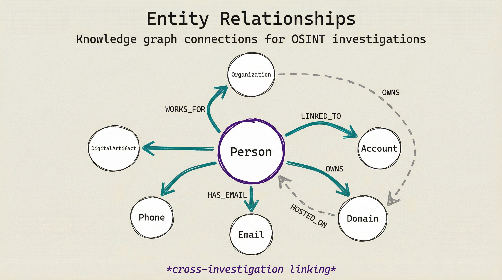

# OSINT Ontology for Graphiti Knowledge Graph

**Version:** 1.0.0
**Purpose:** Define custom entities and relationships for OSINT investigations in Graphiti
**Based On:** STIX 2.1, Schema.org, UCO, OSINT Combine

---

## Table of Contents

1. [Overview](#overview)
2. [Core Entity Types](#core-entity-types)
3. [Relationship Types](#relationship-types)
4. [Temporal Model](#temporal-model)
5. [Confidence Framework](#confidence-framework)
6. [Provenance Tracking](#provenance-tracking)
7. [Implementation Guide](#implementation-guide)

---

<p align="center">
  
</p>

## Overview

### Design Principles

1. **Identity-First** - Focus on resolving real-world entities across platforms
2. **Temporal-Aware** - Track entity state changes over time
3. **Confidence-Scored** - All assertions include certainty levels
4. **Source-Attributed** - Every fact traces to its origin
5. **Civilian-OSINT** - Optimized for non-military investigations

### Entity Hierarchy

```
Real-World Entity
├── Person (individual human)
├── Organization (company, non-profit, government)
├── Location (place, venue, coordinates)
└── Group (social circle, team, community)

Digital Entity
├── Account (platform-specific identity)
├── Domain (website/DNS)
├── Email (email address)
├── Phone (phone number)
├── Image (photo/media)
└── IPAddress (infrastructure)

Investigation Entity
├── Investigation (case)
├── Pivot (discovery path)
└── Report (intel product)
```

---

## Core Entity Types

### 1. Person Entity

**Purpose:** Represent individual human beings (persons of interest, contacts, witnesses)

```typescript
interface PersonEntity {
  // Core Identity
  uuid: string;                    // Unique ID: person_{hash}
  entity_type: "Person";

  // Primary Attributes
  primary_name: string;            // Full legal name
  given_name: string;              // First name
  family_name: string;             // Last name
  middle_name?: string;            // Middle name/initial

  // Identity Variants
  aliases: string[];               // AKA, maiden names
  usernames: UsernameMap;          // platform -> username
  emails: string[];                // Associated emails
  phones: string[];                // Associated phones
  social_accounts: AccountRef[];   // Platform accounts

  // Temporal
  born_at?: datetime;              // DOB (if known)
  active_since?: datetime;         // First online appearance
  last_seen?: datetime;            // Most recent activity

  // Location
  locations: LocationRef[];        // Known locations

  // Professional
  occupations: string[];           // Job titles, roles
  employers: OrganizationRef[];     // Current/past employers

  // Characteristics
  bios: string[];                  // Collected bio/descriptions
  interests: string[];             // Known interests

  // Investigation Metadata
  confidence: number;              // 0-100 overall confidence
  sources: SourceRef[];            // Data sources
  created_at: datetime;
  updated_at: datetime;
  valid_from: datetime;            // When this info became true
  valid_until?: datetime;          // When this info stopped being true
}

type UsernameMap = Record<string, string>;  // platform -> username
```

**Example Episode:**

```
Person: John Smith
- Primary Name: John Smith
- Aliases: ["John A. Smith", "Johnny Smith"]
- Usernames: {twitter: "@jsmith", github: "jsmith-dev"}
- Emails: ["john@example.com", "jsmith@company.com"]
- Born: 1985-03-15
- Locations: ["San Francisco, CA", "New York, NY"]
- Employers: [TechCorp Inc. (2020-present), StartupXYZ (2018-2020)]
- Confidence: 85
- Sources: [LinkedIn Profile, Twitter Bio, Company Directory]
```

### 2. Organization Entity

**Purpose:** Represent companies, non-profits, government entities

```typescript
interface OrganizationEntity {
  uuid: string;
  entity_type: "Organization";

  // Legal Identity
  legal_name: string;             // Official registered name
  dba_names: string[];            // Doing-business-as names
  registration_number: string;     // Corp ID, EIN, etc.
  entity_type: string;            // Corp, LLC, Ltd, NonProfit, Gov
  jurisdiction: string;            // Country/state of incorporation
  status: string;                 // Active, Inactive, Dissolved

  // Temporal
  founded_on: date;
  dissolved_on?: date;
  incorporated_at?: date;

  // Contact
  headquarters: LocationRef;
  website?: string;
  phone?: string;
  email?: string;

  // Structure
  subsidiaries: OrganizationRef[];  // Direct subsidiaries
  parent_company?: OrganizationRef;   // Ultimate parent
  directors: PersonRef[];
  officers: PersonRef[];
  employees: number;               // Employee count

  // Financial
  annual_revenue?: FinancialInfo;
  funding_history: FundingRoundRef[];

  // Investigation
  confidence: number;
  sources: SourceRef[];
  created_at: datetime;
  updated_at: datetime;
  valid_from: datetime;
  valid_until?: datetime;
}

interface FinancialInfo {
  amount: number;
  currency: string;
  year: number;
  estimated: boolean;
}
```

### 3. Account Entity

**Purpose:** Platform-specific digital identities (social media, developer platforms, etc.)

```typescript
interface AccountEntity {
  uuid: string;
  entity_type: "Account";

  // Platform Identity
  platform: string;               // Platform name (twitter, github, etc.)
  platform_id: string;            // Platform-specific user ID
  username: string;              // Handle/screen name
  display_name: string;           // Display name
  url: string;                   // Profile URL

  // Profile Data
  bio?: string;                  // Profile bio/description
  profile_image_url?: string;    // Avatar URL
  banner_image_url?: string;     // Header/banner image
  website_url?: string;          // Linked website
  location?: string;             // Listed location

  // Metrics
  followers_count?: number;
  following_count?: number;
  posts_count?: number;
  listed_count?: number;          // For listed accounts

  // Verification
  verified: boolean;             // Platform verified status
  verification_type?: string;     // Blue check, etc.

  // Temporal
  joined_at?: datetime;           // Account creation date
  last_active?: datetime;         // Last post/activity
  account_status: AccountStatus;  // Active, Suspended, Deleted

  // Identity Resolution
  person_ref?: PersonRef;         // If identity resolved
  confidence: number;             // 0-100
  sources: SourceRef[];
  created_at: datetime;
  updated_at: datetime;
  valid_from: datetime;
  valid_until?: datetime;
}

enum AccountStatus {
  ACTIVE = "Active",
  INACTIVE = "Inactive",
  SUSPENDED = "Suspended",
  DELETED = "Deleted",
  PRIVATE = "Private"
}
```

### 4. Domain Entity

**Purpose:** Represent domain names and DNS infrastructure

```typescript
interface DomainEntity {
  uuid: string;
  entity_type: "Domain";

  // Domain Identity
  name: string;                   // example.com
  tld: string;                    // .com, .org, .io
  registered_date: date;
  expiration_date: date;

  // Registration
  registrar: string;
  registrant_name?: string;
  registrant_org?: string;
  registrant_email?: string;

  // DNS
  nameservers: string[];
  dns_records: DNSRecords;

  // Infrastructure
  ip_address?: string;
  asn?: string;
  asn_owner?: string;
  hosting_provider?: string;
  cdn_provider?: string;

  // SSL
  ssl_certificate?: SSLCertInfo;

  // Ownership
  owner_ref?: OrganizationRef;

  // Investigation
  subdomain_count: number;
  confidence: number;
  sources: SourceRef[];
  created_at: datetime;
  updated_at: datetime;
  valid_from: datetime;
  valid_until?: datetime;
}

interface DNSRecords {
  A: string[];
  AAAA: string[];
  MX: MXRecord[];
  TXT: string[];
  NS: string[];
  CNAME: string[];
  SOA: SOARecord;
}

interface SSLCertInfo {
  issuer: string;
  subject: string;
  valid_from: date;
  valid_until: date;
  sans: string[];
  fingerprint: string;
}
```

### 5. Email Entity

**Purpose:** Represent email addresses and their metadata

```typescript
interface EmailEntity {
  uuid: string;
  entity_type: "Email";

  // Email Identity
  address: string;                // john@example.com
  local_part: string;            // john
  domain: string;                // example.com

  // Validation
  valid: boolean;
  deliverable: boolean;
  disposable: boolean;
  role_based: boolean;

  // Breach History
  breach_count: number;
  breaches: BreachRef[];
  breach_dates: date[];
  exposed_data_types: string[];

  // Social
  gravatar_hash?: string;
  gravatar_profile_url?: string;

  // Reputation
  reputation_score: number;       // 0-100
  trust_score: number;            // 0-100

  // Investigation
  confidence: number;
  sources: SourceRef[];
  created_at: datetime;
  updated_at: datetime;
  valid_from: datetime;
  valid_until?: datetime;
}
```

### 6. Phone Entity

**Purpose:** Represent phone numbers and telecommunications data

```typescript
interface PhoneEntity {
  uuid: string;
  entity_type: "Phone";

  // Phone Identity
  e164_format: string;            // +1234567890
  country_code: string;           // +1
  national_number: string;        // 234567890
  country: string;                // US, UK, etc.

  // Classification
  line_type: LineType;
  carrier: string;
  original_carrier?: string;
  ported: boolean;
  voip_provider?: string;

  // Association
  associated_name?: string;

  // Reputation
  spam_reports: number;
  fraud_flags: boolean;
  risk_score: number;             // 0-100

  // Investigation
  first_seen?: date;
  confidence: number;
  sources: SourceRef[];
  created_at: datetime;
  updated_at: datetime;
  valid_from: datetime;
  valid_until?: datetime;
}

enum LineType {
  MOBILE = "Mobile",
  LANDLINE = "Landline",
  VOIP = "VOIP",
  TOLL_FREE = "TollFree",
  PREMIUM_RATE = "PremiumRate"
}
```

### 7. Location Entity

**Purpose:** Represent geographic locations

```typescript
interface LocationEntity {
  uuid: string;
  entity_type: "Location";

  // Location Identity
  name: string;                   // San Francisco, California
  type: LocationType;

  // Geospatial
  coordinates?: {
    latitude: number;
    longitude: number;
    precision: number;           // Accuracy in meters
  };

  // Address
  address?: string;
  city?: string;
  region?: string;                // State/Province
  country?: string;
  postal_code?: string;

  // Metadata
  confidence: number;             // Location certainty
  determined_by: string;          // How location was found
  inference_method?: string;

  // Investigation
  sources: SourceRef[];
  created_at: datetime;
  updated_at: datetime;
  valid_from: datetime;
  valid_until?: datetime;
}

enum LocationType {
  GPS = "GPS",
  CITY = "City",
  REGION = "Region",
  COUNTRY = "Country",
  VENUE = "Venue",
  LANDMARK = "Landmark",
  ADDRESS = "Address"
}
```

### 8. Image Entity

**Purpose:** Represent images and EXIF metadata

```typescript
interface ImageEntity {
  uuid: string;
  entity_type: "Image";

  // Image Identity
  url: string;
  hash_md5: string;
  hash_sha256: string;
  format: string;

  // Properties
  dimensions: {
    width: number;
    height: number;
  };
  file_size: number;

  // EXIF Data
  camera?: {
    make: string;
    model: string;
    lens?: string;
  };
  gps?: {
    latitude: number;
    longitude: number;
    altitude?: number;
    location_name?: string;
  };
  timestamps?: {
    taken?: datetime;
    digitized?: datetime;
    modified?: datetime;
  };

  // Analysis
  authenticity?: {
    verdict: AuthenticityVerdict;
    confidence: number;
    manipulation_score: number;
    anomalies: string[];
  };

  // Reverse Search
  reverse_search?: {
    first_seen: date;
    occurrence_count: number;
    domains: string[];
  };

  // Investigation
  confidence: number;
  sources: SourceRef[];
  created_at: datetime;
  updated_at: datetime;
  valid_from: datetime;
  valid_until?: datetime;
}

enum AuthenticityVerdict {
  AUTHENTIC = "Authentic",
  MODIFIED = "Modified",
  AI_GENERATED = "AI_Generated",
  INCONCLUSIVE = "Inconclusive"
}
```

### 9. Investigation Entity

**Purpose:** Represent investigation cases and tracking

```typescript
interface InvestigationEntity {
  uuid: string;
  entity_type: "Investigation";

  // Investigation Identity
  id: string;                    // OSINT-INV-2026-001
  original_target: string;
  target_type: TargetType;

  // Configuration
  scope: InvestigationScope;
  max_depth: number;
  current_depth: number;

  // Temporal
  started_at: datetime;
  completed_at?: datetime;

  // Results
  entities_discovered: number;
  pivots_followed: number;
  pivots_deferred: number;

  // Output
  report_ref?: ReportRef;

  // Metadata
  confidence: number;
  created_at: datetime;
  updated_at: datetime;
}

enum TargetType {
  PERSON = "person",
  COMPANY = "company",
  DOMAIN = "domain",
  INFRASTRUCTURE = "infrastructure"
}

enum InvestigationScope {
  NARROW = "narrow",
  STANDARD = "standard",
  WIDE = "wide"
}
```

---

## Relationship Types

### Identity Resolution Relationships

| Relationship | Direction | Description | Confidence |
|--------------|-----------|-------------|------------|
| `SAME_PERSON_AS` | Bidirectional | Confirmed same person | 95-100% |
| `LIKELY_SAME_PERSON` | Bidirectional | Probable same person | 70-94% |
| `POSSIBLY_SAME_PERSON` | Bidirectional | Tentative match | 50-69% |
| `DIFFERENT_PERSON` | Bidirectional | Confirmed not same person | 95-100% |

### Digital Identity Relationships

| Relationship | Source | Target | Description |
|--------------|--------|--------|-------------|
| `HAS_EMAIL` | Person | Email | Person owns/uses email |
| `HAS_PHONE` | Person | Phone | Person associated with phone |
| `HAS_ACCOUNT` | Person | Account | Person's platform account |
| `HAS_USERNAME` | Person | Account | Person's username on platform |
| `REGISTERED_WITH` | Account | Email | Account registered with email |
| `LISTED_IN_BREACH` | Email | Breach | Email exposed in breach |

### Professional Relationships

| Relationship | Source | Target | Properties |
|--------------|--------|--------|------------|
| `WORKS_AT` | Person | Organization | since: date, title: string |
| `DIRECTOR_OF` | Person | Organization | appointed: date, resigned: date |
| `OFFICER_OF` | Person | Organization | position: string, since: date |
| `FOUNDER_OF` | Person | Organization | founded: date |
| `EMPLOYS` | Organization | Person | since: date |

### Corporate Relationships

| Relationship | Source | Target | Properties |
|--------------|--------|--------|------------|
| `PARENT_OF` | Organization | Organization | ownership_pct: number |
| `SUBSIDIARY_OF` | Organization | Organization | ownership_pct: number |
| `OWNS` | Organization | Domain | since: date |
| `FUNDED_BY` | Organization | Investor | round: string, date: date, amount: number |
| `COMPETES_WITH` | Organization | Organization | market: string |

### Infrastructure Relationships

| Relationship | Source | Target | Properties |
|--------------|--------|--------|------------|
| `RESOLVES_TO` | Domain | IPAddress | record_type: string |
| `HOSTS` | IPAddress | Domain | reverse_dns: string |
| `HAS_SUBDOMAIN` | Domain | Domain | discovered: date |
| `EXPOSES` | IPAddress | Port | state: string |
| `RUNS` | Port | Service | version: string |

### Social Relationships

| Relationship | Source | Target | Properties |
|--------------|--------|--------|------------|
| `KNOWS` | Person | Person | platform: string, since: date |
| `FRIEND_OF` | Person | Person | platform: string |
| `FOLLOWS` | Account | Account | since: date |
| `CONNECTED_TO` | Person | Person | degree: number |

### Location Relationships

| Relationship | Source | Target | Properties |
|--------------|--------|--------|------------|
| `LOCATED_AT` | Person | Location | since: date |
| `REGISTERED_AT` | Organization | Location | type: string |
| `HEADQUARTERED_AT` | Organization | Location | |
| `CAPTURED_AT` | Image | Location | coordinates: object |

### Temporal Relationships

| Relationship | Source | Target | Properties |
|--------------|--------|--------|------------|
| `WAS` | Entity | State | from: date, to: date |
| `BECAME` | Entity | State | at: date |
| `CEASED` | Entity | State | at: date |

### Investigation Relationships

| Relationship | Source | Target | Properties |
|--------------|--------|--------|------------|
| `DISCOVERED_IN` | Entity | Investigation | depth: number, method: string |
| `GENERATED_PIVOT` | Entity | Pivot | priority: string, type: string |
| `CHAINED_FROM` | Pivot | Pivot | depth: number |
| `DEFERRED_FROM` | DeferredPivot | Investigation | reason: string |

---

## Temporal Model

### Bi-Temporal Tracking

Graphiti uses bi-temporal data modeling:

```typescript
interface TemporalMetadata {
  // When the fact was added to the system
  created_at: datetime;

  // When the fact was last modified
  updated_at: datetime;

  // When the fact was true in the real world
  valid_from: datetime;
  valid_until?: datetime;    // null = currently true

  // Point-in-time query reference
  as_of_date?: date;
}
```

### Entity State Evolution

```
Person Employment History:

John Smith —[WORKS_AT]→ TechCorp (2020-2022)
                                    |
                                    └──[BECAME]→ Unemployed (2022)
                                                    |
                                                    └──[WORKS_AT]→ StartupXYZ (2022-present)
```

### Temporal Query Examples

```cypher
// What did we know about John Smith in June 2021?
MATCH (p:Person {name: "John Smith"})
WHERE p.valid_from <= datetime("2021-06-30")
  AND (p.valid_until >= datetime("2021-06-01") OR p.valid_until IS NULL)
RETURN p

// Employment history over time
MATCH (p:Person {name: "John Smith"})-[r:WORKS_AT]->(o:Organization)
RETURN r.valid_from, r.valid_until, o.name
ORDER BY r.valid_from
```

---

## Confidence Framework

### Confidence Levels

| Level | Range | Label | Criteria |
|-------|-------|-------|----------|
| **Confirmed** | 95-100% | CONFIRMED | Multiple independent verifications, exact matches |
| **High** | 80-94% | HIGH | Strong evidence, single point of failure possible |
| **Medium** | 60-79% | MEDIUM | Corroborating evidence, some uncertainty |
| **Low** | 40-59% | LOW | Single source, unverified |
| **Tentative** | 0-39% | TENTATIVE | Preliminary, requires verification |

### Confidence Calculation

```typescript
interface ConfidenceFactors {
  // Source reliability (30%)
  source_reliability: number;   // Track record of source

  // Corroboration (25%)
  corroboration_count: number;   // Independent sources
  cross_verified: boolean;

  // Recency (15%)
  data_freshness: number;        // How current is the data

  // Consistency (15%)
  internal_consistency: number;  // Within data

  // Verification (15%)
  directly_verified: boolean;

  calculated: number;            // 0-100
}
```

### Confidence by Evidence Type

| Evidence Type | Base Confidence | Multipliers |
|---------------|-----------------|-------------|
| Verified email match | 95% | +2% per additional platform |
| Exact profile picture | 90% | +5% if multiple sources |
| Cross-platform bio match | 75% | +5% if unique phrases |
| Username pattern match | 50% | +10% if rare username |
| Network overlap | 60% | +5% per mutual connection |
| Temporal correlation | 55% | +5% if timezone matches |

---

## Provenance Tracking

### Source Reference Structure

```typescript
interface SourceRef {
  source_id: string;
  source_type: SourceType;
  name: string;
  url?: string;
  accessed_at: datetime;
  reliability: number;           // 0-100
  verification_method: string;
}

enum SourceType {
  PLATFORM = "platform",         // Social media platform
  REGISTRY = "registry",         // Corporate/public registry
  PUBLIC_RECORD = "public_record",
  BREACH_DATABASE = "breach_database",
  DNS_WHOIS = "dns_whois",
  INFRASTRUCTURE = "infrastructure", // Shodan, Censys
  NEWS_MEDIA = "news_media",
  PROFESSIONAL_DIRECTORY = "professional_directory",
  KNOWLEDGE_GRAPH = "knowledge_graph" // Previous investigations
}
```

### Collection Metadata

```typescript
interface CollectionMetadata {
  collector: {
    agent: string;              // Agent/Workflow name
    workflow: string;           // Specific workflow
    version: string;            // Skill version
    timestamp: datetime;
  };

  processing: {
    transformations: string[];  // Processing steps
    quality_flags: string[];   // Quality concerns
    confidence_factors: string[];
  };
}
```

---

## Implementation Guide

### Phase 1: Define Custom Entities in Graphiti

```python
# src/custom_entities/person.py
from pydantic import BaseModel
from datetime import datetime
from typing import List, Optional, Dict
from enum import Enum

class LineType(str, Enum):
    MOBILE = "Mobile"
    LANDLINE = "Landline"
    VOIP = "VOIP"
    TOLL_FREE = "TollFree"
    PREMIUM_RATE = "PremiumRate"

class PersonEntity(BaseModel):
    """Custom Person entity for OSINT investigations"""

    # Core
    uuid: str
    entity_type: str = "Person"

    # Identity
    primary_name: str
    given_name: str
    family_name: str
    middle_name: Optional[str] = None

    # Variants
    aliases: List[str] = []
    usernames: Dict[str, str] = {}
    emails: List[str] = []
    phones: List[str] = []

    # Temporal
    born_at: Optional[datetime] = None
    active_since: Optional[datetime] = None
    last_seen: Optional[datetime] = None

    # Location
    locations: List[str] = []

    # Professional
    occupations: List[str] = []
    employers: List[str] = []

    # Metadata
    confidence: float = 0.0
    sources: List[str] = []
    created_at: datetime
    updated_at: datetime
    valid_from: datetime
    valid_until: Optional[datetime] = None

    class Config:
        json_schema_extra = {
            "example": {
                "uuid": "person_abc123",
                "primary_name": "John Smith",
                "given_name": "John",
                "family_name": "Smith",
                "usernames": {"twitter": "@jsmith", "github": "jsmith-dev"},
                "confidence": 85.0
            }
        }

# Register with Graphiti
CUSTOM_ENTITIES = {
    "Person": PersonEntity,
    # ... add other entities
}
```

### Phase 2: Custom Relationship Extraction

```python
# src/custom_relationships.py
from graphiti_core.edges import Edge

class IdentityResolutionEdge(Edge):
    """Identity resolution relationship"""

    def __init__(self,
                 source_node_uuid: str,
                 target_node_uuid: str,
                 relationship_type: str,  # SAME_PERSON_AS, LIKELY_SAME_PERSON
                 confidence: float,
                 evidence: List[str],
                 valid_from: datetime,
                 valid_until: Optional[datetime] = None):
        super().__init__(
            source_node_uuid=source_node_uuid,
             target_node_uuid=target_node_uuid,
             created_at=datetime.now(datetime.UTC)
        )
        self.relationship_type = relationship_type
        self.confidence = confidence
        self.evidence = evidence
        self.valid_from = valid_from
        self.valid_until = valid_until

# Relationship type mapping
RELATIONSHIP_TYPES = {
    "SAME_PERSON_AS": IdentityResolutionEdge,
    "LIKELY_SAME_PERSON": IdentityResolutionEdge,
    # ... other relationship types
}
```

### Phase 3: Episode Processing for OSINT

```python
# src/episode_processors/osint_processor.py
from graphiti_core import Graphiti
from graphiti_core.observations import Episode
from src.custom_entities import PersonEntity
from src.custom_relationships import IdentityResolutionEdge

class OSINTEpisodeProcessor:
    """Process OSINT episodes into custom entities"""

    def __init__(self, graphiti: Graphiti):
        self.graphiti = graphiti

    async def process_username_recon(self, episode_body: str):
        """Process username enumeration episode"""

        # Extract entities using LLM
        entities = await self._extract_entities(episode_body)

        # Create Person entity
        person = PersonEntity(
            uuid=f"person_{self._generate_hash()}",
            primary_name=entities.get("name"),
            usernames=entities.get("usernames", {}),
            confidence=entities.get("confidence", 70.0),
            sources=entities.get("sources", []),
            created_at=datetime.now(datetime.UTC),
            updated_at=datetime.now(datetime.UTC),
            valid_from=datetime.now(datetime.UTC)
        )

        # Add to Graphiti
        await self.graphiti.add_episode(
            name="username_recon",
            episode_body=episode_body,
            source=EpisodeType.text,
            source_description="OSINT Username Reconnaissance"
        )

        # Link accounts to person
        for platform, username in person.usernames.items():
            await self._link_account_to_person(
                platform, username, person.uuid
            )
```

### Phase 4: Knowledge Graph Groups

```
osint-people         - Person entities
osint-organizations   - Organization entities
osint-accounts       - Platform accounts
osint-domains        - Domain/DNS entities
osint-emails         - Email entities
osint-phones         - Phone entities
osint-locations      - Location entities
osint-images         - Image entities
osint-investigations - Investigation cases
osint-pivots         - Pivot tracking
osint-relationships  - Cross-entity relationships
```

---

## Appendix: Quick Reference

### Entity Type Summary

| Entity | Use For | Key Attributes |
|--------|---------|----------------|
| **Person** | Individuals | name, aliases, usernames, emails |
| **Organization** | Companies | legal_name, registration_number, directors |
| **Account** | Platform IDs | platform, username, display_name |
| **Domain** | Websites | name, dns_records, ssl_certificate |
| **Email** | Email addresses | address, breach_history, reputation |
| **Phone** | Phone numbers | e164_format, line_type, carrier |
| **Location** | Places | name, coordinates, type |
| **Image** | Photos | hash, exif, gps, authenticity |
| **Investigation** | Cases | id, target_type, scope, depth |

### Relationship Type Summary

| Category | Key Relationships |
|----------|------------------|
| **Identity** | SAME_PERSON_AS, LIKELY_SAME_PERSON, HAS_ACCOUNT |
| **Professional** | WORKS_AT, DIRECTOR_OF, FOUNDER_OF |
| **Corporate** | PARENT_OF, SUBSIDIARY_OF, FUNDED_BY |
| **Digital** | RESOLVES_TO, HOSTS, HAS_SUBDOMAIN |
| **Social** | KNOWS, FOLLOWS, CONNECTED_TO |
| **Location** | LOCATED_AT, HEADQUARTERED_AT, CAPTURED_AT |
| **Temporal** | WAS, BECAME, CEASED |

---

**Version:** 1.0.0
**Last Updated:** 2026-02-04
**Maintained By:** MadeInOz OSINT Skill
