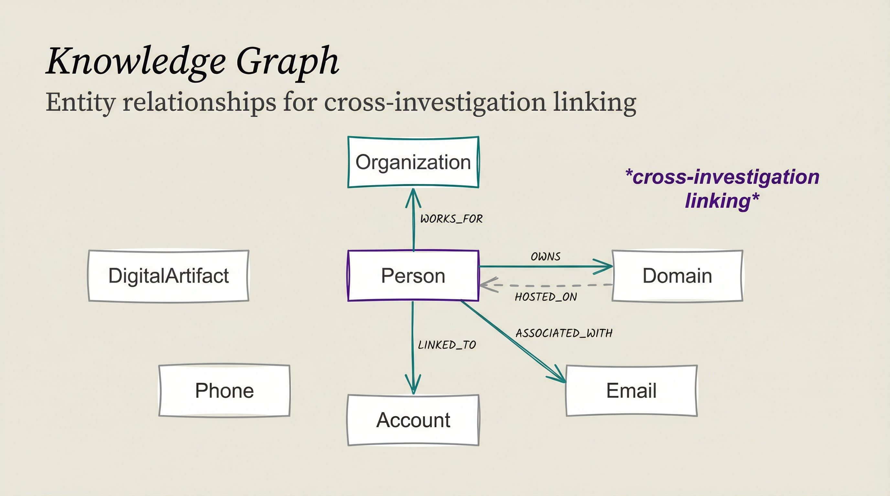

# Knowledge & Memory Model

The OSINT skill persists intelligence findings through a pluggable memory adapter: MuninnDB MCP when the host provides it (preferred), a local `osint-findings/` log otherwise. Findings are stored atomically, tagged by group, and linked so future investigations can pivot on them. See `skills/osint/SKILL.md` § Memory Adapter for the adapter contract.

<p align="center">
  
</p>

## Documentation

- **[OSINT Ontology](OSINT_ONTOLOGY.md)** - Complete ontology for OSINT entities and relationships
- **[Ontology Quick Reference](ONTOLOGY_QUICK_REFERENCE.md)** - Quick lookup for entity types
- **[Graphiti Implementation](GRAPHITI_IMPLEMENTATION.md)** - Legacy backend notes (retired optional integration, kept for history)

## Key Concepts

### Entity Types

- **Person** - Individuals under investigation
- **Organization** - Companies, non-profits, government entities
- **Domain** - Websites and infrastructure
- **Email** - Email addresses and breach data
- **Phone** - Phone numbers and carrier information
- **Account** - Social media and service accounts
- **DigitalArtifact** - Images, documents, files

### Relationship Types

- **OWNS** - Ownership relationships
- **WORKS_FOR** - Employment associations
- **ASSOCIATED_WITH** - General associations
- **HOSTED_ON** - Infrastructure relationships
- **LINKED_TO** - Identity correlations

## Investigation Persistence

All OSINT investigations store findings via the memory adapter:

```
# Reload or query past investigations
Recall osint findings about username johndoe
What companies are linked to domain example.com?
Show me all findings from OSINT investigations in the past week
```
